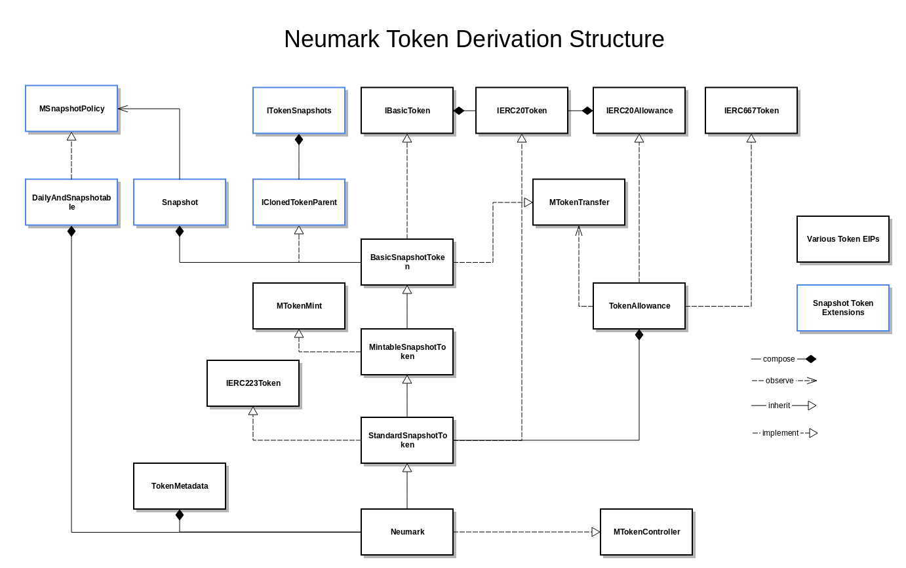

# Snaphot & Neumark token

Complicated derivation structure above reflects current standardization state of Ethereum tokens.
Black boxes are interfaces or building blocks that are result of various EIPs implementations. Blue
boxes represent token extension: snapshot token.

## Implementation patterns

Contract types:

1. Public interfaces: function exposed to other contracts, names start with **I....**
2. Internal interfaces, internal functions exposed (when implemented) or expected (when
   **observed**) to be implemented by other contracts. Internal interfaces enable two patterns: they
   allow to compose (mix in) varius implementations of given functionality (look how _Snapshot_
   contract observes _MSnapshotPolicy_ and how contracts in Snapshot/Extras implement it). Names
   start with **M..**
3. Mixins: implementations of interfaces intended to be composed with other contracts (see
   _TokenAllowance_ or _TokenMetadata_).
4. Contracts: along main derivation path, see StandardSnapshotToken derivation.

## Ethereum token standards implemented

Having a choice of combining various EIPs in one piece of monolithic code or to create building
blocks that can be mixed together to provide token with desired functionalities, we have chosen the
second option.

* IBasicToken, BasicSnapshotToken and MTokenTransfer implement token with transfer rights: well
  known `balanceOf`, `totalSupply` and `transfer` functions.
* MTokenMint, MintableSnapshotToken add internal functions to generate and destroy tokens
  (increase/decrease totalSupply)
* TokenAllowance and IERC20Allowance implement `transferFrom` functionality of ERC20 standard
* IERC667Token adds (implemented in TokenAllowance) `approveAndCall` mechanism for transferring
  tokens to contracts. We use this pattern as it is compatible with ERC20 token
* StandardSnapshotToken implements IERC20Token fully by mixing TokenAllowance and
  BasicSnapshotToken. It also provides IERC223Token interface and implementation in ERC20 compatible
  way (this standard is still in discussion and growing in scope recently).
* TokenMetadata provide token name, symbol and decimal places, which is optional part of ERC20. It
  is not part of standard token in our scheme - implemented in concrete implementations only (like
  Neumark).

* BasicSnapshotToken and TokenAllowance also observe MTokenController internal interface which
  allows to enable/disable approvals and token transfers. This kind of functionality is also
  discussed in ERC223 proposal.

## Snapshot token

Current EIPs are just handling token transfer rights in various ways. However Neufund tokens
(including Neumark) represent much more complicated rights like

1. a right to revenue (in ether or other tokens) that is acquired by the token holder and should not
   be voided on transferring the token later (existing revenue not transferable).
2. a right to vote - once vote was cast it should not be transferable or canceled by token ownership
   transfer.
3. other rights that are earned at some point in time and are decoupled from actual token balance.

Those are very common and fundamental rights that are earned and the way to solve it is to attach
such right to token holder balance at particular point in time. What we do here is an improvement
over [MiniMe](https://github.com/Giveth/minime) token by Jordi Baylina (see
StandardSnapshotToken.sol for copyright notice.).

Interface _ITokenSnapshots_ provides access to historical balances of a token. Those balances are
saved at particular points in time (snapshots). Comparing to MiniMe token, we abstract away snapshot
generating mechanism: balaces may be stored with every block change (like MiniMe) but also daily
(Neumark) or as requested (_ISnapshotable_ interface).

On top of such mechanism, implementing revenue disbursal or voting mechanism is possible (even
trivial). Cloning tokens is also pretty easy (check _IClonedTokenParent_ interface).

Finally, we provide snapshot storage to be used in any contract via _Snapshot_ contract.
